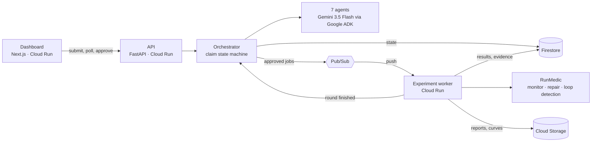

# LabGuard AI

**Challenge the claim. Protect the run. Trust the result.**

An autonomous research reliability platform. It takes a research claim, finds
the scientific loopholes that could explain the result away, runs the smallest
experiments that would settle them, watches every run for failures and repairs
what it safely can, then issues an evidence-backed verdict.

Two loops over one shared state:

* **The Scientific Skeptic loop** asks whether the evidence actually supports
  the conclusion — even if every run succeeded.
* **The Experiment Guardian loop** asks whether each run is executing
  correctly, and repairs what it is allowed to.

Built for **The Taskmaster** track: a complete workflow, run to completion,
not a chat window.

---

## Quick start

No cloud project, no API key, no network.

```bash
git clone <repo> && cd LabGuard-AI
make setup                 # Python venv + npm install
make demo                  # full workflow, headless, ~20 seconds
```

That runs claim submission → loophole detection → planning → approval →
asynchronous execution → live health monitoring → recovery → recursive audit →
verdict, and prints the result.

For the dashboard, in two terminals:

```bash
make api                   # FastAPI on http://127.0.0.1:8080
make dashboard             # Next.js on http://localhost:3000
```

Open <http://localhost:3000>. The launcher has two modes: **Bundled scenario**
(click *Start verification*) and **Your own claim**, where you describe a
comparison of your own and LabGuard verifies that instead.

Requirements: Python 3.11+, Node 20+.

---

## What you will see

The bundled scenario is a claim worth rejecting:

> *"Model B performs better than Model A on the violence-detection benchmark."*

Reported on a single seed, with Model B trained for 90 epochs against Model A's
25, and both checkpoints selected on the test split.

LabGuard's corrected comparison — five seeds, equal budget, validation-selected
checkpoints — finds:

| Metric | Mean difference over 5 seeds | 95% interval | Seeds the candidate wins |
| --- | ---: | --- | ---: |
| Accuracy | +0.0058 | [−0.0142, +0.0258] | 3 of 5 |
| Macro F1 | −0.0491 | [−0.0849, −0.0133] | **0 of 5** |
| Balanced accuracy | −0.0704 | [−0.0903, −0.0505] | **0 of 5** |

The class-wise breakdown says why: the gain sits entirely in the majority
class, while minority-class recall drops from 0.45 to 0.34.

**Verdict: not sufficiently supported.**

Along the way it detects overfitting in the reported run, recovers a submitted
variant that genuinely diverges to NaN, and stops a corrupted-checkpoint job
after three identical failures rather than retrying forever.

## Verifying your own claim

Switch the launcher to **Your own claim**, or `POST /api/claims` directly
(see [`docs/API.md`](docs/API.md)). You supply the claim, the dataset shape,
the two configurations being compared, and the result you already have.

One thing to be clear about, and the form says so too: LabGuard rebuilds a
synthetic benchmark with the shape you describe and trains those two
configurations itself. It does not read your real dataset or attach to your
training code. What it verifies is the *reasoning* — whether a difference of
the size you report would survive equal budgets, more seeds, class-balanced
metrics and honest checkpointing. The loophole detection, the recursion, the
health monitoring and the scoring all run on your numbers.

### These weaknesses are real

The imbalance, the metric reversal, the divergence, the overfitting and the
unchanging failure are properties of the data generator and the training loop —
not scripted outputs. The test suite asserts it:

```bash
cd backend && .venv/bin/python -m pytest tests/test_experiments.py -v
```

---

## The dashboard

| Section | What it shows |
| --- | --- |
| **Overview** | Claim, verdict, seven reliability dimensions with their arithmetic, budget, active agent, recent incidents |
| **Claim map** | The claim, its measurable subclaims with evidence, detected loopholes, alternative explanations |
| **Experiment plan** | Proposed actions, why each was chosen, cost, expected information gain, validated parameters, approval controls |
| **Queue** | Every job across planned / awaiting approval / queued / running / recovered / failed / loop-blocked / completed |
| **Live run health** | Streaming training and validation curves, the RunMedic timeline, per-seed paired deltas with intervals |
| **Evidence ledger** | Append-only audit trail: agent, action, reason, input, result, decision, artifacts |
| **Final report** | Verdict, every reliability check with its weight and outcome, evidence, remaining uncertainty, reproducibility, download |

Anything simulated — accelerator memory and utilisation, which come from an
analytic model of the configuration — is labelled `simulated` wherever it
appears. Everything else is measured.

---

## Architecture



Full diagrams, the trust boundary and the safety properties are in
[`docs/ARCHITECTURE.md`](docs/ARCHITECTURE.md). The state machines are in
[`docs/AGENT_STATE_MACHINE.md`](docs/AGENT_STATE_MACHINE.md).

### The seven agents

They share state through the store and never talk to each other directly, which
is what makes the ledger a complete account of the run.

1. **Claim Analyst** — turns one claim into measurable subclaims
2. **Scientific Skeptic** — finds loopholes and rival explanations
3. **Experiment Planner** — picks the cheapest decisive next actions
4. **Run Manager** — queues and tracks approved work
5. **RunMedic** — watches runs, repairs within policy, breaks loops
6. **Evidence Auditor** — turns measurements into conclusions, decides whether to recurse
7. **Verdict Agent** — issues the final status with traceable evidence

### The model proposes; validated code disposes

Gemini reaches the system only through ADK `LlmAgent`s with a strict
`output_schema`, and **those agents are given no tools**. Every response is a
proposal that gets checked:

* it may *name* an action, only from a typed registry, and only from the
  candidate set the planner already validated against the budget;
* parameters are validated with pydantic and bound-checked — twice, once at
  planning and again in the worker before execution;
* it cannot produce a number: every metric, interval, per-class figure, health
  detection and reliability score is computed in Python;
* if its proposed verdict status disagrees with the measured one, the
  measurement wins and the disagreement is written to the ledger.

There is no path from model output to a shell, an `eval`, or a file write.

### Safe action registry

Fourteen typed actions, each with validated parameters, an estimated cost, a
retry limit, an execution status, an audit record and a minimum autonomy level.

`run_seed_comparison` · `recalculate_metrics` · `evaluate_classwise` ·
`check_data_overlap` · `compare_configurations` · `inspect_training_curve` ·
`sweep_decision_threshold` · `test_domain_shift` · `apply_early_stopping` ·
`retry_transient_failure` · `reduce_batch_size` ·
`adjust_learning_rate_within_bounds` · `resume_from_checkpoint` ·
`generate_reliability_report`

### Autonomy modes

| Mode | Runs without asking |
| --- | --- |
| **Observe only** | Nothing. Detections and recommendations only — approving a plan does not override this. |
| **Safe repair** | Diagnostics, early stopping, transient retries, checkpoint resume. |
| **Managed autonomy** | The above, plus bounded learning-rate and batch-size changes, extra seeds, inexpensive diagnostics. |

Expensive experiments, dataset changes and budget overruns require approval at
every level.

### Reliability score

Seven dimensions — reproducibility, data integrity, baseline fairness,
statistical stability, training health, evidence completeness, and overall
claim confidence. Each is a **weighted pass rate over named checks**, and the
report shows every check, its weight, whether it passed, and why:

```
data.no_train_test_overlap   (weight 3) — pass — No test row duplicates a
                                           training row. 0 overlapping rows
                                           across 1000 test rows.
```

Gemini is never asked for a score.

---

## Demo mode and cloud mode

Every external dependency sits behind a port with two implementations. The
orchestrator, worker, state machine and dashboard are identical in both, so
demo mode is not a mock — it is the product with different adapters.

| Port | `LABGUARD_MODE=cloud` | `LABGUARD_MODE=demo` |
| --- | --- | --- |
| State | Firestore | in-memory, same document shapes |
| Job bus | Pub/Sub → push → worker | asyncio queue → *same* worker handler |
| Artifacts | Cloud Storage | local `./artifacts` |
| Reasoning | Gemini 3.5 Flash via ADK | deterministic rule engine |

The in-process bus is genuinely asynchronous — publishing returns immediately
and a background consumer executes the job later — so the queued → running →
recovering → completed transitions are real, with a configurable simulated
latency so they are visible.

If Gemini is unreachable in cloud mode, each agent falls back to the rule engine
for that step. The workflow always completes; only the prose changes.

---

## Deploying to Google Cloud

Requires `gcloud` authenticated against a project with billing enabled.

```bash
export GOOGLE_CLOUD_PROJECT=your-project
export GOOGLE_CLOUD_REGION=us-central1
./deploy/provision.sh "$GOOGLE_CLOUD_PROJECT" "$GOOGLE_CLOUD_REGION"
```

The script is idempotent and:

1. enables Cloud Run, Pub/Sub, Firestore, Cloud Storage, Artifact Registry,
   Cloud Build, Vertex AI and Cloud Logging;
2. creates the Artifact Registry repository, the Firestore database, the
   artifact bucket and the `labguard-jobs` / `labguard-events` topics;
3. creates three service accounts with least-privilege roles;
4. builds both images and deploys **three Cloud Run services** — the dashboard,
   the API, and a private experiment worker that scales to zero;
5. wires a Pub/Sub push subscription to the worker, authenticated with its own
   service account.

It prints the dashboard URL when finished.

Verify:

```bash
curl -s "$(gcloud run services describe labguard-api --region="$GOOGLE_CLOUD_REGION" \
  --format='value(status.url)')/health" | python3 -m json.tool
```

`infrastructure` should read `FirestoreStateStore`, `PubSubJobBus`,
`GcsArtifactStore` and `gemini-adk:<model id>`. The dashboard header shows the
same values, so what is running is always visible.

Then seed it:

```bash
python scripts/seed_demo.py --api "$(gcloud run services describe labguard-api \
  --region="$GOOGLE_CLOUD_REGION" --format='value(status.url)')"
```

For manual control, `deploy/cloudbuild.yaml` builds and deploys, and
`deploy/service-api.yaml` / `deploy/service-worker.yaml` are declarative
equivalents for `gcloud run services replace`.

> **Note on what has and has not been executed.** The deployment configuration
> in `deploy/` and the two `Dockerfile`s have not been run: this repository was
> developed in an environment with no cloud credentials, no `gcloud` CLI and no
> Docker daemon, so neither the image builds nor the Cloud Run deployment have
> been verified end to end. Treat them as reviewed configuration, not as a
> tested deployment.
>
> Everything else in this README has been run and verified: the headless demo
> workflow, the API, the dashboard driven through a real browser, the 74 tests,
> the linters, the type checks and the production build.

### Configuration

Copy `.env.example` to `.env`. Everything has a working default for demo mode.
The settings that matter:

| Variable | Default | Purpose |
| --- | --- | --- |
| `LABGUARD_MODE` | `demo` | `demo` or `cloud` — selects the adapter set |
| `GOOGLE_CLOUD_PROJECT` | — | Required for cloud mode |
| `GOOGLE_API_KEY` | — | Gemini Developer API key; or use Vertex below |
| `GOOGLE_GENAI_USE_VERTEXAI` | `false` | Use Vertex AI with the service account instead of a key |
| `GEMINI_MODEL` | `gemini-3.5-flash` | Falls through `GEMINI_MODEL_FALLBACKS` if unavailable |
| `WORKER_SHARED_SECRET` | — | Required bearer token on the worker's push endpoint |
| `SIMULATED_QUEUE_LATENCY` | `0.6` | Visible queue delay in demo mode |
| `SIMULATED_EPOCH_DELAY` | `0.0` | Set to ~`0.03` to make training curves visibly stream during a live demo |
| `ENABLE_CLOUD_LOGGING` | `false` | Attach the Cloud Logging handler; otherwise structured JSON goes to stdout |
| `MAX_PLANNING_ROUNDS` | `4` | Bounds the recursive verification loop |

---

## Development

```bash
make test        # 74 backend tests, ~35s
make lint        # ruff + tsc + next lint
make check       # both
make build       # production dashboard build
make clean
```

The tests cover the synthetic benchmark's weaknesses, the action registry and
its approval rules, RunMedic's detection logic, the full claim-to-verdict
workflow under each autonomy mode, the HTTP API, and the guard rails around
the Gemini runtime — that an invented action is refused, that costs and
approval requirements are never taken from the model, and that a disagreeing
verdict status is overruled by the measured one.

```bash
python scripts/run_demo.py --autonomy safe_repair --no-approve   # stop at the gate
python scripts/run_demo.py --json                                # machine-readable
python scripts/seed_demo.py --api http://127.0.0.1:8080          # over HTTP
```

---

## Documentation

| Document | Contents |
| --- | --- |
| [`docs/ARCHITECTURE.md`](docs/ARCHITECTURE.md) | System and workflow diagrams, the trust boundary, safety properties |
| [`docs/AGENT_STATE_MACHINE.md`](docs/AGENT_STATE_MACHINE.md) | Claim and job state machines, agent responsibilities, autonomy, loop detection |
| [`docs/API.md`](docs/API.md) | Every endpoint, with request and response bodies |
| [`docs/DEMO_SCRIPT.md`](docs/DEMO_SCRIPT.md) | Four-minute walkthrough, with fallbacks |
| [`docs/DEVPOST.md`](docs/DEVPOST.md) | Devpost feature and technology summary |

## Licence

MIT — see [`LICENSE`](LICENSE).
