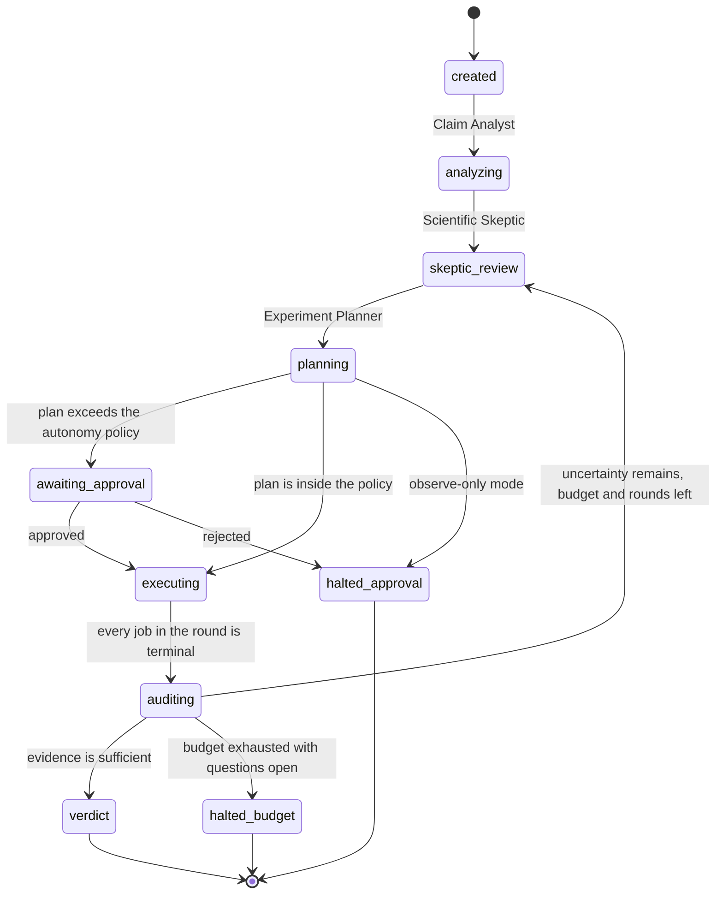
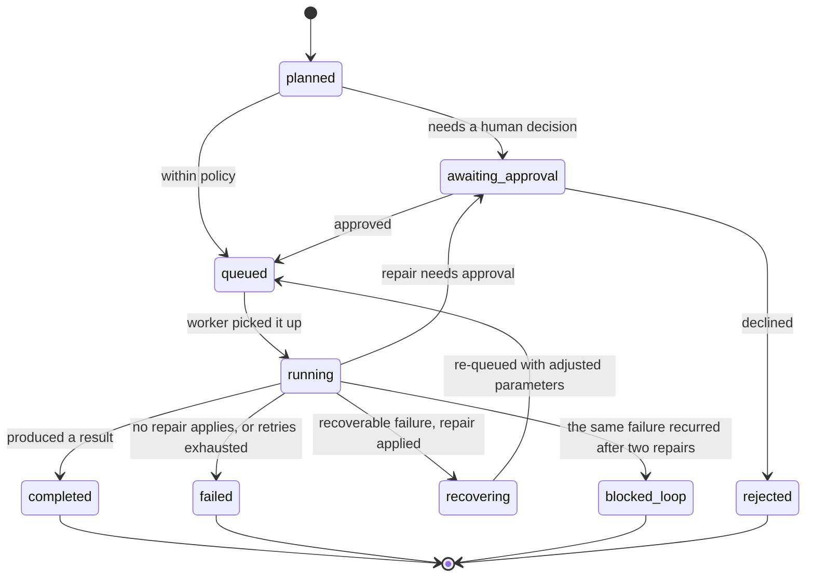

# Agent state machines

Two machines run concurrently: one per claim, one per job. The orchestrator
owns the claim machine; the worker owns the job machine. They meet at exactly
two points — the orchestrator publishes a job, and the worker calls back when
one reaches a terminal state.

## Claim states

`auditing → skeptic_review` is the recursion. The loop is bounded by
`MAX_PLANNING_ROUNDS` (default 4) and by the compute budget, whichever binds
first. It also terminates naturally: the planner returns an empty round when
no remaining action could change a conclusion, which goes straight to verdict.

The claim only reports `verdict` once the verdict has been written and stored.
Clients stop polling on a terminal state, so publishing it earlier would freeze
them on a snapshot with no verdict in it.

## Job states

## The seven agents

| Agent | Reads | Writes | Decides |
| --- | --- | --- | --- |
| **Claim Analyst** | claim text, dataset, model configs, reported results | subclaims | how one claim becomes measurable parts |
| **Scientific Skeptic** | the same, plus subclaims | loopholes, alternative explanations | what could explain the result away |
| **Experiment Planner** | open loopholes, untested subclaims, evidence, budget | an experiment plan | the cheapest decisive next actions |
| **Run Manager** | approved plans | jobs, bus messages | what is published, and when |
| **RunMedic** | live curves, failures, job history | health events, repairs, loop escalations | whether to stop, repair, retry or escalate |
| **Evidence Auditor** | completed jobs and their measurements | subclaim statuses, loophole resolutions | what the numbers mean, and whether to recurse |
| **Verdict Agent** | everything, plus the reliability score | the verdict and its report | the final status and its justification |

All seven share state through the store. There is no agent-to-agent chat: an
agent's only way to influence another is to write something the next one reads,
which is what makes the ledger a complete account of the run.

## Autonomy policy

Autonomy is evaluated per action, at the moment of scheduling, against four
independent conditions. Any one of them forces approval.

| Condition | Effect |
| --- | --- |
| Mode is `observe_only` | Everything is recommended, nothing executes — approving does not override this |
| Action's `min_autonomy` exceeds the claim's mode | Approval required |
| Estimated cost exceeds the remaining budget | Approval required |
| An experiment costs more than `approval_threshold_units` | Approval required |

| Mode | Runs without asking |
| --- | --- |
| **Observe only** | Nothing. Detections and recommendations only. |
| **Safe repair** | Diagnostics, early stopping, transient retries, checkpoint resume. |
| **Managed autonomy** | The above, plus bounded learning-rate and batch-size changes, extra seeds, and inexpensive diagnostics. |

Expensive experiments require approval at every level. In the bundled scenario
`run_seed_comparison` costs 8 units against a 6-unit threshold, so it always
stops for a human.

## Loop detection

A job carries a `failure_signature`: the anomaly kind plus the first 80
characters of the error. RunMedic escalates when

* the same signature appears after two recovery attempts (`recovery_loop`), or
* attempts exceed `MAX_TOTAL_ATTEMPTS` (`excessive_retries`).

A job is also never scheduled twice: every job has a fingerprint over
`(action_type, validated params)`, and the planner skips any fingerprint
already present, so an identical experiment cannot be proposed a second time.

In the bundled scenario the reported checkpoint fails its integrity check
identically on every attempt. LabGuard tries, repairs, tries again, sees the
identical signature, and stops at three attempts with
`state = blocked_loop` — the reproducibility subclaim is then recorded as
`inconclusive` rather than quietly passing.
