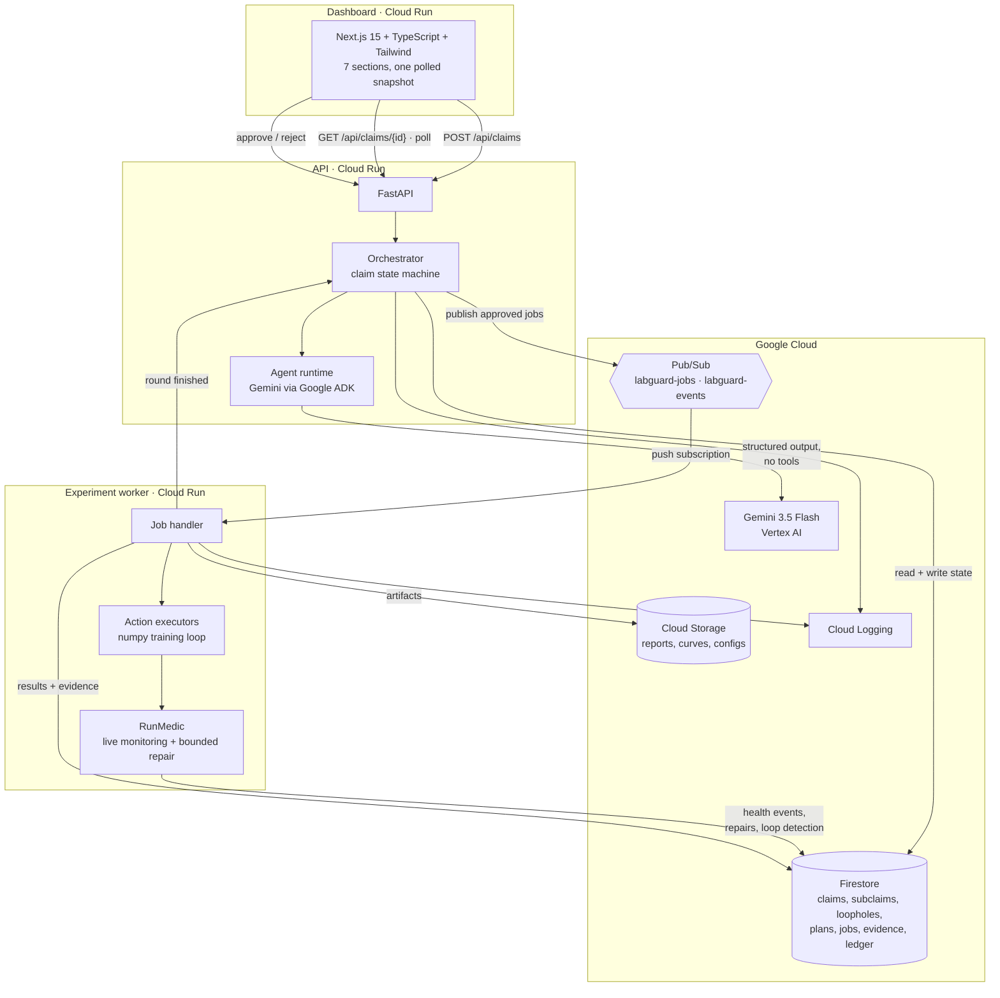
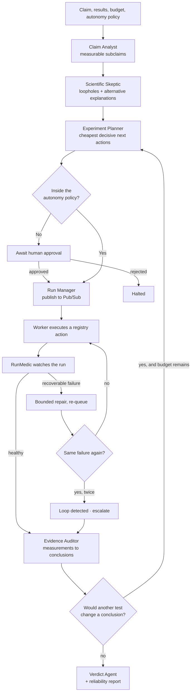

# Architecture

LabGuard AI is two intelligence loops over one shared, persistent state.

* The **Scientific Skeptic loop** asks whether the evidence actually supports
  the conclusion, even if every run succeeded.
* The **Experiment Guardian loop** asks whether each run is executing
  correctly, and repairs what it safely can.

They are not separate products. The Guardian's findings become evidence the
Skeptic reasons about — an overfitting run is both an operational incident and
a reason to distrust the checkpoint the result was reported from.

## System diagram



## The recursive verification loop



## Two deployments, one code path

Every external dependency sits behind a port with two implementations. The
orchestrator, the worker, the state machine and the dashboard are identical in
both, so demo mode is not a mock of the product — it is the product with
different adapters.

| Port | Cloud mode | Demo mode |
| --- | --- | --- |
| `StateStore` | `FirestoreStateStore` | `InMemoryStateStore` |
| `JobBus` | `PubSubJobBus` → push → worker | `InProcessJobBus` (asyncio queue, simulated latency) |
| `ArtifactStore` | `GcsArtifactStore` | `LocalArtifactStore` |
| `AgentRuntime` | `AdkAgentRuntime` (Gemini via ADK) | `DeterministicRuntime` |

`InProcessJobBus` is genuinely asynchronous: publishing returns immediately and
a background consumer executes the job later, through the *same* worker handler
Pub/Sub push calls. That is what makes the queued → running → recovering →
completed transitions real rather than animated.

## Where the model is trusted, and where it is not

Gemini reaches LabGuard only through ADK `LlmAgent`s with a strict
`output_schema`, and those agents are given **no tools**. The model cannot
execute anything: it proposes, and the typed action registry disposes.

| Decision | Who makes it |
| --- | --- |
| Subclaim and loophole wording | Gemini (rule engine supplies the set) |
| Which loopholes exist in the submission | Rule engine, from the submitted configuration |
| Loophole severity | Rule engine; model-proposed extras are capped at 0.6 |
| Which action runs next | Gemini **chooses from** the registry-validated candidate set |
| Action parameters, cost, retry limit | Registry, validated with pydantic |
| Whether approval is required | Autonomy policy and budget, never the model |
| Every metric, interval and per-class figure | Python, from real training runs |
| Whether a run is unhealthy | `agents/health.py`, pure functions over the curve |
| The seven reliability scores | `scoring/reliability.py`, weighted named checks |
| The verdict status | Rule engine. A disagreeing model status is recorded and overruled |
| The verdict narrative | Gemini, constrained to quote supplied figures |

If Gemini is unreachable or returns something unparseable, each agent falls
back to the rule engine for that step. The workflow completes either way; only
the prose changes.

## Safety properties

1. **No arbitrary execution.** There is no path from model output to a shell,
   an `eval`, or a file write. Actions are looked up by name in a fixed
   registry and their parameters are validated and bound-checked.
2. **Repairs are bounded.** `adjust_learning_rate_within_bounds` clamps to
   `[min_lr, max_lr]` declared on the action, whatever is proposed.
3. **Approval cannot be bypassed.** Observe-only refuses to execute even an
   explicitly approved plan, and says so rather than silently running.
4. **Loops terminate.** Two identical failure signatures after recovery, or
   more than three attempts, moves a job to `blocked_loop` and escalates.
5. **Budget is enforced before execution**, not after: an action costing more
   than the remaining budget requires approval.
6. **The ledger is append-only** and every row records who acted, why, on what
   input, with what result, and what was decided.

## Repository layout

```
backend/labguard/
  models/         domain objects and enums (one file per concern)
  agents/         health detection, rule engine, ADK/Gemini runtime
  actions/        typed registry + executors
  experiments/    dataset, training loop, metrics, demo scenario
  infra/          store, bus and artifact ports with both implementations
  scoring/        reliability dimensions as named checks
  api/            FastAPI app and schemas
  orchestrator.py claim state machine
  worker.py       job execution and RunMedic
frontend/
  app/            launcher and dashboard shell
  components/     UI primitives, charts, seven sections
  lib/            API client, types, formatting, polling hook
deploy/           Dockerfiles, Cloud Build, Cloud Run manifests, provisioning
scripts/          run_demo.py (headless workflow), seed_demo.py (over HTTP)
```
